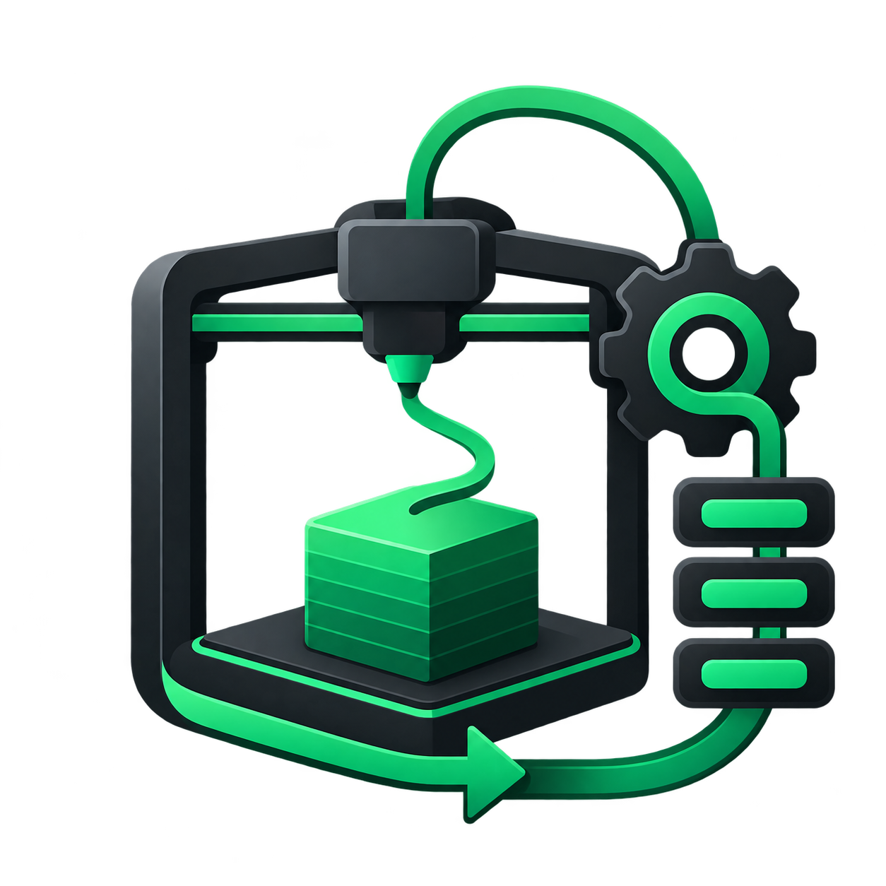

# Print Farm Operator



**A practical operations agent for small 3D printing farms, built on OpenClaw and Plow's runtime.**

I designed and built Print Farm Operator to explore what an AI operations hire could look like for a small 3D-printing business. The agent helps an owner configure a farm, inspect STL geometry, review quote and production readiness, and track manually operated jobs while keeping persistent operational state.

### What I built

- Persistent farm, customer request, quote, order, and production-job workflows.
- Owner, operator, and customer roles with authorization boundaries.
- STL inspection and a CuraEngine-based slicing/quoting research path.
- Quote trust gates and audit events around production transitions.
- A manual printer adapter that keeps physical production human-confirmed rather than pretending the agent controls hardware.
- An OpenClaw variant running on **Plow's official runtime**, using Plow's chat surface, model route, credentials, Latch integration, and Agent Index reporting.

The project intentionally separates the AI conversation layer from deterministic domain operations and keeps printer-control integrations behind adapters so the workflow can evolve without coupling the agent to a specific printer ecosystem.

## Install and use

This source install uses Plow's normal chat line. It does not need an OpenAI API
key, WhatsApp account, macOS, or Messages.app. The base image uses the model
route provided by Plow. A tester needs a Plow account, a free line, Docker with
Compose, Git, and Python 3.11 or newer.

1. Install the official [plow-agents CLI](https://github.com/plow-pbc/plow-agents):

   ```sh
   git clone https://github.com/plow-pbc/plow-agents.git /tmp/plow-agents
   export PATH="/tmp/plow-agents/bin:$PATH"
   plow-agents login
   ```

   Follow its activation prompt from your phone. Then select a free line:

   ```sh
   plow-agents lines
   ```

2. Clone this public repository and change into it:

   ```sh
   git clone https://github.com/caio-pellegrini/print-farm-operator-openclaw-hackathon.git
   cd print-farm-operator-openclaw-hackathon
   ```

3. Mint a local credential for the free Plow line shown in step 1:

   ```sh
   plow-agents mint LINE_UID
   ```

   The command creates the ignored plow-credentials file in this checkout.
   Keep it private.

4. Build and start the variant:

   ```sh
   docker compose up --build -d
   docker compose logs -f agent
   ```

   The local OpenClaw dashboard is at <http://localhost:3001>. For the normal
   tester flow, message the selected Plow line from the phone used to activate
   the account. Plow's standard chat runtime handles the conversation.

5. Complete the persistent farm onboarding in that conversation. The agent asks
   about printer count and models, nozzle sizes, solo/team operation, primary
   slicer/material, and whether customer messaging might be useful later. Each
   answer is saved immediately, then the agent summarizes the configured farm.

6. In WebChat, attach a single STL with the browser file selector to create a
   private request and job and receive its persisted analysis. It does not issue
   a price or approved quote. A new conversation can retrieve the farm
   configuration and latest analysis/request/job. Confirm production actions
   with a human operator; they are recorded through ManualPrinterAdapter and
   never control a printer.

Keep the Compose volume named state to retain this installation's farm data,
OpenClaw sessions, Agent Index identity, and reporting key. docker compose down
preserves it. Do not use docker compose down -v unless you intend to erase that
installation.

## Cloud deployment

The Dockerfile is a variant of Plow's maintained OpenClaw base, pinned to an
immutable image digest. Plow cloud deployment additionally requires the public
variant image to be admitted for the Agent Index listing. That admission is
controlled by a Plow admin. Until the image is admitted, testers can build and
run from source using the local steps above.

## Agent Index usage

The image sets AGENT_ID=print-farm-operator. The inherited Plow reporter
registers the installation when needed, reads actual OpenClaw session token
usage, and reports every five minutes. It saves a fresh installation identity,
Index reporting key, and usage ledger in /var/lib/plow; it does not read this
developer's .stage1, WhatsApp session, SQLite data, or OpenClaw state.

After the tester sends a real prompt, check reporter status in the container:

```sh
docker compose exec -e HOME=/var/lib/plow agent python3 /opt/plow/agent-index-client.py status
docker compose exec -e HOME=/var/lib/plow agent python3 /opt/plow/agent-index-client.py --agent print-farm-operator --dry-run
```

The first command checks that this install has an Index key. The second
collects actual local usage without posting it. The inherited reporter sends
the measured usage automatically on its next five-minute pass. Verify the
public listing at
<https://aiworthusing.com/agent-index/print-farm-operator>. The Index client
does not send prompts, job content, STL filenames, or source files.

The listing owner can update the public repository and project image metadata
after logging in with the official CLI:

    plow-agents image set print-farm-operator \
      --name "Print Farm Operator" \
      --blurb "A 3D printing farm operations agent for STL analysis, quoting review, and manual production workflows." \
      --repo https://github.com/caio-pellegrini/print-farm-operator-openclaw-hackathon \
      --link https://github.com/caio-pellegrini/print-farm-operator-openclaw-hackathon \
      --screenshot https://raw.githubusercontent.com/caio-pellegrini/print-farm-operator-openclaw-hackathon/main/logo.png

The Agent Index listing currently retains a previously published YouTube
video. Its title and availability resolve, but it has not been verified as a
demo of this Plow-based build. Record a real tester run and then replace the
listing video metadata. The repository demo checklist tracks that remaining
work.

## Domain and runtime boundaries

- **OpenClaw on Plow:** Plow's pinned base owns startup, model routing, standard
  phone-line chat, Plow credentials, optional Latch connectivity, and usage
  reporting. There is no macOS or iMessage dependency.
- **Farm domain:** Python modules under experiments/ retain STL analysis,
  onboarding, farm configuration, identity and role authorization, persistent
  orders/quotes/jobs, quote readiness gates, production workflow, audit events,
  and ManualPrinterAdapter.
- **Domain bridge:** docker/plow_domain_tools.py fixes the database to the
  current installation's persistent volume and dispatches the existing domain
  operations. Messaging identity is not stored in or interpreted by the farm
  domain.
- **Printers:** manual operator-confirmed workflow only. There is no Bambu,
  OctoPrint, Moonraker, or other printer control.
- **Slicing:** the fixed Cura adapter and quote approval logic remain in the
  source. A Docker-based Cura runtime is not bundled in the Plow image, so
  automated slicing and new quote creation are not part of this source-install
  smoke path.
- **WhatsApp:** source files remain for historical/experimental use, but they
  are not copied into the runtime image, needed for installation, or used by
  the demo.

See [architecture](docs/openclaw-architecture.md),
[limitations](docs/limitations.md), [Agent Index metadata](docs/agent-index-metadata.json),
and the [demo capture checklist](docs/demo-video.md). The project logo is
included as logo.png. A recorded demo video still needs a real tester run.

## License

This project is MIT licensed. The Plow base image and inherited Agent Index
client have their own licenses; see [license and distribution notes](docs/licenses-and-distribution.md)
and the upstream Plow repositories.
