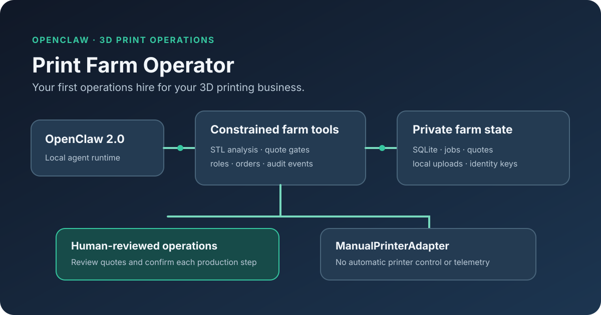

# Print Farm Operator

**Your first operations hire for your 3D printing business.**

Print Farm Operator is an OpenClaw agent for small 3D printing businesses. It combines STL analysis, production estimates, quote review gates, customer and staff authorization, persistent orders and jobs, and a manually operated production workflow. It is designed to help a human operator coordinate work; it does not control a printer automatically.



## Current status

This is an early release candidate. The repository contains the current OpenClaw 2.0 project and Stages 1–6 of its implementation. The manual production workflow is validated at its local domain/API boundary. WhatsApp integration is **experimental** and is not required for setup or demonstration. Telegram is not implemented. Bambu Studio has a tested CLI slicing path, but GUI parity and physical print validation are pending; Bambu quoting remains blocked. See [limitations](docs/limitations.md), [Stage 5 report](docs/stage-5-report.md), and [Stage 6 report](docs/stage-6-report.md).

## Quick start

Requirements: Docker with Compose, an OpenAI API key for agent conversations, and a browser for the local OpenClaw interface.

```sh
export OPENAI_API_KEY='your-provider-key'
docker compose up --build -d
docker compose logs -f print-farm-operator
```

The Gateway is bound to `127.0.0.1:18789` on the host. Its generated access token is stored in the persistent `print-farm-data` volume at `/data/secrets/gateway-token`. Inspect the local token with:

```sh
docker compose exec print-farm-operator cat /data/secrets/gateway-token
```

Use the OpenClaw Control UI/dashboard with that token. The persistent volume holds OpenClaw conversation state, farm SQLite data, private uploads, identity signing material, and Agent Index install state. Back it up as private operational data; do not add it to source control or a public image.

## Installation and configuration

To run the published container directly:

```sh
docker pull ghcr.io/caio-pellegrini/print-farm-operator:v1
docker volume create print-farm-data
docker run -d --name print-farm-operator \
  --restart unless-stopped \
  -p 127.0.0.1:18789:18789 \
  -e OPENAI_API_KEY \
  -v print-farm-data:/data \
  ghcr.io/caio-pellegrini/print-farm-operator:v1
```

Provide model-provider credentials through environment variables such as `OPENAI_API_KEY`; provide other OpenClaw settings in the local persistent config at `/data/openclaw/openclaw.json`. The container generates a Gateway token and per-deployment identity key in `/data/secrets` on first boot. Never bake provider keys, Gateway credentials, WhatsApp credentials, or `PLOW_AGENT_TOKEN` into an image. `PLOW_AGENT_TOKEN` is needed only for registration; after registration, the Agent Index client uses its stored reporting key.

The clean image starts OpenClaw 2026.8.1 and builds the checked-in print-farm plugin. The image does not import `.stage1`, local OpenClaw credentials, SQLite data, tester records, or WhatsApp session state. For safety, the Gateway port is published only on host loopback by the supplied Compose file.

## Demo flow

1. Start the container and open the local OpenClaw interface with its Gateway token. On first use, Print Farm Operator introduces itself and offers to configure the farm in about a minute.
2. Answer one setup question at a time: printer count, model and nozzle per printer, solo/team operation, primary slicer and material, and whether customer messaging may be useful later. Every answer is saved immediately, so setup resumes after a restart. At completion, the agent summarizes the persisted farm and asks whether you want to send an STL.
3. Attach one STL in WebChat. OpenClaw's managed media hook imports it into private job storage and runs the existing analyzer automatically; no folder copy is needed. The agent reports its dimensions, geometric volume, basic mesh validity, request/job state, and quote-readiness. It does not suggest a price unless the applicable slicer/profile has passed the quote trust gates. The estimate path is documented in the plugin README.
4. For a solo owner, the initial user has both OWNER and OPERATOR roles. Use `list_ready_jobs`, inspect a job, assign one of the listed manual printers, and record the operator-confirmed start and completion.
5. Start a new conversation, ask about the configured printers or slicer, and confirm that the persisted farm summary is still available.

The local production tools are offered only in owner-authenticated WebChat. Separate operator identities still need provisioning before team members can use the tools from their own OpenClaw identity.

Use sample models without customer information. The current container does not include a Docker daemon or printer slicer images. The isolated Cura and other slicer adapters expect their approved runtime images and a Docker-capable host; the one-click image is therefore a local OpenClaw/runtime release candidate, not a turnkey slicer or printer-control appliance.

## Architecture

- **OpenClaw Gateway 2.0:** agent runtime, local Control UI, sessions, and plugin host.
- **Print-farm plugin:** constrained code-backed tools; it delegates to fixed Python entry points and does not expose arbitrary shell commands to the model.
- **Application/domain layer:** STL checks and analysis, slicer abstraction, quote trust gates, role/capability authorization, persistent jobs/orders/quotes, and audit/job events.
- **Persistence:** SQLite domain data and OpenClaw's own conversation stores live in the private `/data` volume, independently of the read-only application files.
- **Production adapter:** `ManualPrinterAdapter` records operator-confirmed assignment/start/completion without claiming printer telemetry or sending printer commands.
- **Agent Index:** the official standalone client reads OpenClaw's local per-agent SQLite transcript usage and runs alongside the Gateway every five minutes. Its report/install state is retained in the same private volume.

The architecture image is [available as SVG](docs/images/print-farm-operator-architecture.svg).

## Security and trust boundaries

- Each installation is a separate trusted farm boundary. OpenClaw multi-user sessions are not application authorization.
- Customer identities can submit and read their own requests; staff roles are explicitly linked and authorized in the application. Customers cannot inspect staff queues or other customers' jobs.
- Quotes remain subject to profile readiness, approval, and evidence gates. Slicer output is an estimate, not a guaranteed production result.
- STL files and intake staging data belong under private runtime directories in `/data`; do not mount customer files into public source or image layers.
- The Gateway is loopback-bound on the host by default. If you expose it beyond the machine, configure and review authentication and network access first.
- The Agent Index receives the usage data the official client reports; it does not send prompts or customer filenames. Registration publishes the listing text, repository, install URL, video, images, and logo supplied to the client.

## Known limitations

- WhatsApp is experimental; live channel behavior is not part of the release acceptance criteria. This task did not change or debug it.
- Telegram is not implemented.
- Bambu A1 0.4 mm/Bambu Studio CLI execution has been investigated and exercised, but GUI parity and physical printing have not been validated; material estimates are not safe for quoting. Bambu remains blocked from quote approval.
- Cura, Orca, Bambu, and Creality profile/metric validation is incomplete. Only the current configured model-facing slicer path should be treated as available, and runtime images are not bundled in this Gateway image.
- Printer control, live telemetry, OctoPrint/Moonraker/Bambu/Creality connections, automatic scheduling, and unattended production are not included.
- OpenClaw starts cleanly without a provider key, but model conversations require the operator's provider credentials.

## Agent Index publication

Provisional listing:

- Slug: `print-farm-operator`
- Name: `Print Farm Operator`
- Blurb: `Your first operations hire for your 3D printing business.`
- Repository: <https://github.com/caio-pellegrini/print-farm-openclaw-agent>
- Public image: `ghcr.io/caio-pellegrini/print-farm-operator:v1`

The repo includes the official [standalone Agent Index client](standalone/agent_index_client.py). The container checks OpenClaw's own transcript store and reports usage every five minutes after a transcript database exists. The PLOW login token is supplied at registration time only; it is not stored in the image. Keep the persistent `/data` volume so the client retains the install ID and reporting key.

To register this install after you have exercised at least one agent turn:

```sh
git clone https://github.com/plow-pbc/plow-agents.git /tmp/plow-agents
export PATH="/tmp/plow-agents/bin:$PATH"
plow-agents login
export PLOW_AGENT_TOKEN="$(cat ~/.config/plow/token)"
docker compose exec print-farm-operator python3 /opt/print-farm-operator/standalone/agent_index_client.py \
  --agent print-farm-operator --dry-run
docker compose exec -e "PLOW_AGENT_TOKEN=$PLOW_AGENT_TOKEN" print-farm-operator \
  python3 /opt/print-farm-operator/standalone/agent_index_client.py \
  --register --agent print-farm-operator \
  --name 'Print Farm Operator' \
  --blurb 'Your first operations hire for your 3D printing business.' \
  --repo https://github.com/caio-pellegrini/print-farm-openclaw-agent \
  --install-url https://github.com/caio-pellegrini/print-farm-openclaw-agent
plow-agents image push ghcr.io/caio-pellegrini/print-farm-operator:v1
plow-agents profile --show
```

The login command prints an activation phrase and phone number; complete that step from your phone. GHCR may prompt for a GitHub classic personal access token with package write permission. After the first successful push, make the package public in GitHub Packages settings and use the digest reference printed by the CLI when you contact the Agent Index admins.

The vendored upstream client is adjusted so `--dry-run` can collect and display local usage before registration; the upstream version currently checks for an Index-issued reporting key even in dry-run mode. Dry-run does not send a usage report. Registration still needs the Plow login token, and subsequent reports need the Index-issued key persisted in the volume.

The current checkout has no project-specific square logo; the architecture diagram above is the prepared project image. A polished logo remains a follow-up. A short screen-capture plan is in [demo video instructions](docs/demo-video.md); the video itself remains to be recorded.

## License

This repository is MIT licensed. Separately distributed runtime components may carry their own licenses; see [license and distribution notes](docs/licenses-and-distribution.md).
